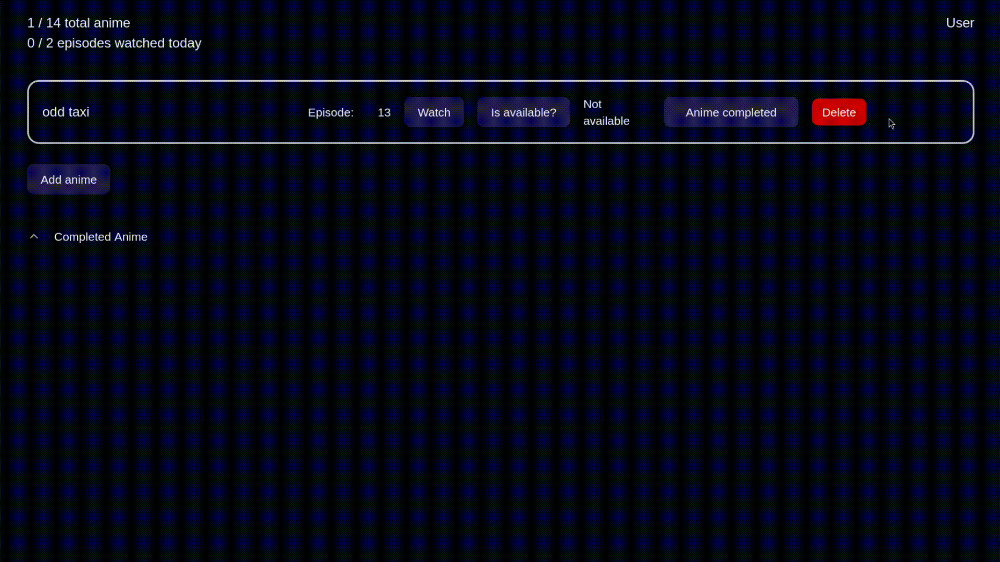

# Limit Watch Time
Limit Watch Time is a web app that lets users optimize their time by limiting the number of episodes they can watch daily.

## Demo

Take a quick look at how it works:

  

## TechStack Highlight

<strong style="font-size:16px;">Frontend:</strong>

<strong style="font-size:16px;">Backend:</strong>
    

<strong style="font-size:16px;">Database:</strong>

<strong style="font-size:16px;">Devops:</strong>

## Status

- **Stage:** In development (WIP)  
- **Deployment:** None (local build only)

